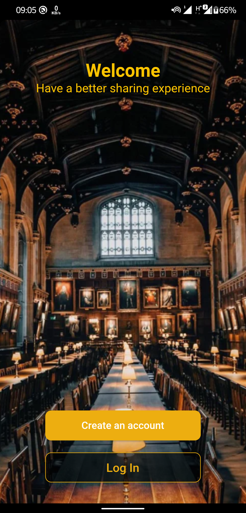
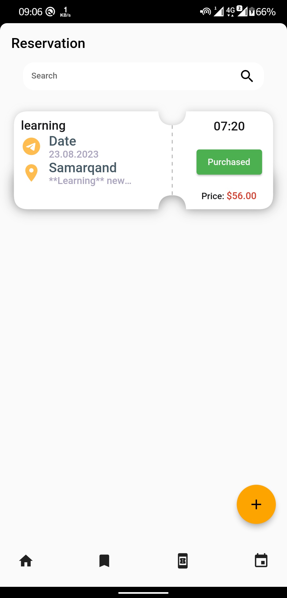
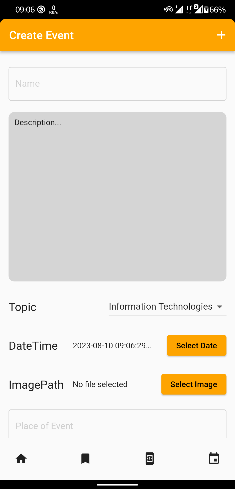

# ticket_booking

Ticket booking app is a flutter app that allows users to book tickets for events.

## Figma ui design

[Ticket Booking UI](https://www.figma.com/file/SjU3a9Os6i4EwtiXwBQM2O/Ticket-booking-system-ui?type=design&node-id=1%3A3&mode=design&t=7k9zJ4c4ALxSdjqJ-1)

## Screenshots of the app

<!-- div thet places horizontally -->

## Getting Started

This project is a starting point for a Flutter application.

A few resources to get you started if this is your first Flutter project:

- [Lab: Write your first Flutter app](https://docs.flutter.dev/get-started/codelab)
- [Cookbook: Useful Flutter samples](https://docs.flutter.dev/cookbook)

For help getting started with Flutter development, view the
[online documentation](https://docs.flutter.dev/), which offers tutorials,
samples, guidance on mobile development, and a full API reference.
